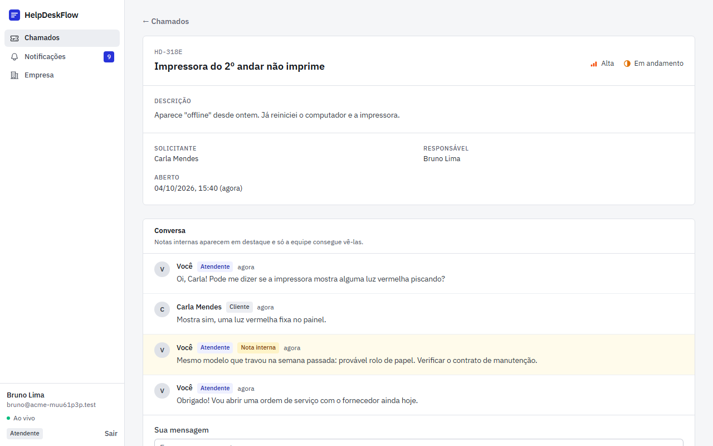
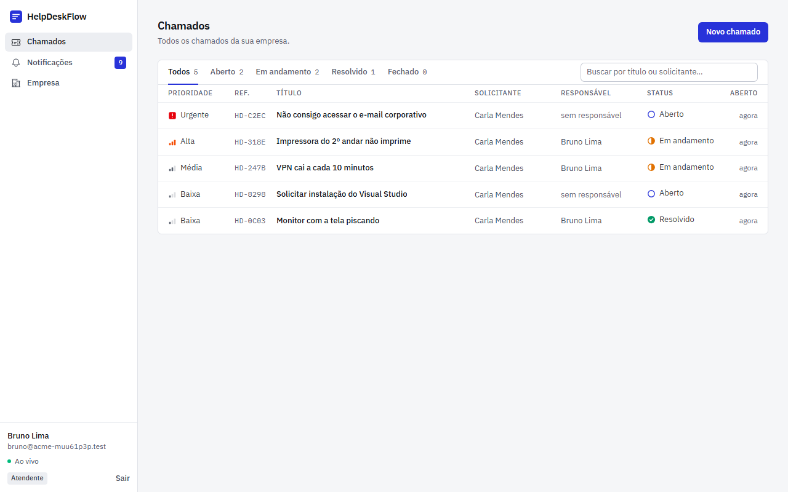
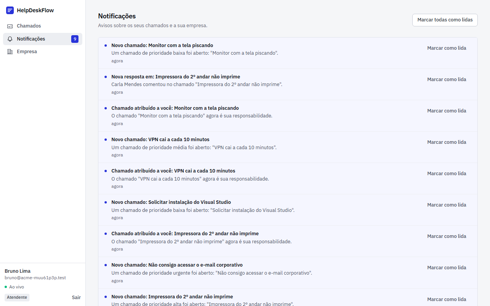
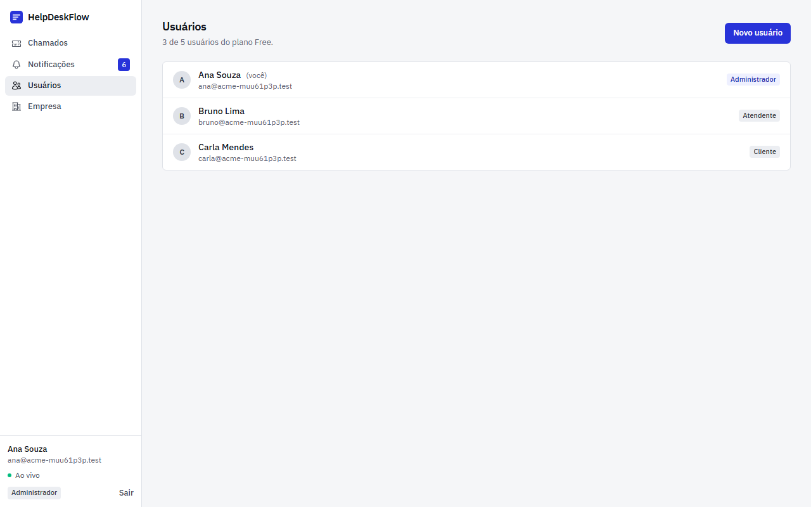
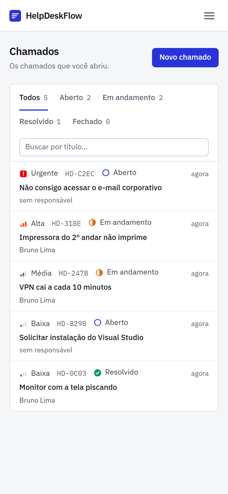
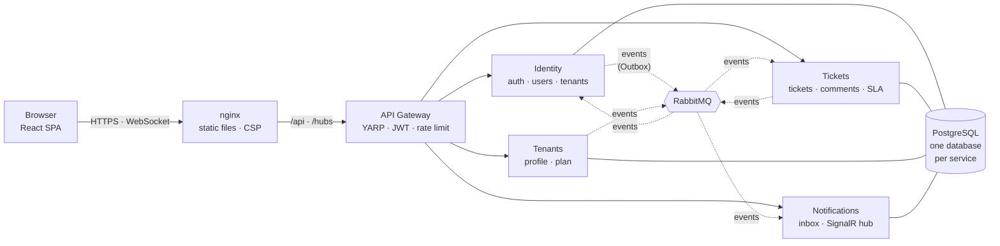

# HelpDeskFlow

[](https://github.com/Rianzzz/helpdeskflow/actions/workflows/ci.yml) 

English · [Português](README.pt-BR.md)

A help desk for multiple companies, built as four .NET 9 services behind a gateway, with a React front-end. Companies sign up, add their team and customers, and handle support tickets. Each company only sees its own data, and everyone is notified live when a ticket changes.



*The agent's view of a ticket. The yellow message is an internal note: the customer never receives it, not even as a notification.*

I built it to learn how a system like this is split, secured, tested and deployed, so the interesting parts are less the screens than what sits behind them.

## What's in it

- **Services.** Identity (login, users, companies), Tickets, Tenants (company profile and plan) and Notifications, behind a YARP gateway. Each service has its own PostgreSQL database and they only talk through RabbitMQ events.
- **Events that don't get lost.** A service writes the event in the same database transaction as the data (a transactional Outbox) and a background job publishes it afterwards. Consumers ignore duplicates, retry on failure and send what still fails to a dead-letter queue.
- **Signing up a company.** It touches Identity and Tenants, and there is no transaction across services. It runs as a saga: if the second step fails, the first one is undone, and there is a timeout for the case where nothing answers.
- **Tenant isolation.** Enforced in the database with EF Core global query filters. The company id always comes from the token, never from the request body.
- **Authentication.** JWT with rotating refresh tokens, reuse detection, account lockout and rate limiting. Details in [docs/seguranca.md](docs/seguranca.md).
- **Real time.** SignalR pushes notifications to the browser, with polling as fallback. The token that travels in the URL is redacted from every log.
- **Kubernetes.** Kustomize manifests, Pod Security `restricted`, a default-deny NetworkPolicy, migrations in init containers and rolling updates without downtime. Scripts check these rules, including killing pods while requests are running.
- **Observability.** Structured logs, distributed traces that stay connected across the Outbox, and health checks.

## Screens

All screens come from the running platform (`cd web && npm run screenshots` regenerates them).

**Tickets.** A dense list: priority and status shown by icon plus text, a short reference per ticket, filters by status and search. Staff see every ticket of the company; a customer only sees their own.



**Live notifications.** The counter in the menu and this list update on their own through SignalR. The green "Ao vivo" indicator at the bottom left shows the connection is up; if it drops, the screen falls back to polling.



**Users and plan limit.** The admin manages the team. The Free plan allows 5 users, enforced on the server even if the button were hidden.



**On a phone.** The same list, with the menu collapsed.



## Architecture



Each service is layered `Api → Infrastructure → Application → Domain`, and the domain depends on nothing. More in [docs/arquitetura.md](docs/arquitetura.md) (Portuguese).

## Stack

| Area | Technologies |
|---|---|
| Backend | C#, .NET 9, ASP.NET Core Minimal APIs, EF Core 9, Npgsql, YARP, SignalR, RabbitMQ.Client |
| Front-end | React 19, TypeScript, Vite, Tailwind CSS 4, React Router, TanStack Query |
| Data and messaging | PostgreSQL 17, RabbitMQ 4 |
| Observability | Serilog, OpenTelemetry, Jaeger, health checks |
| Testing | xUnit, Testcontainers, Vitest, Testing Library, Playwright, axe-core |
| Delivery | Docker (multi-stage, non-root), Docker Compose, Kubernetes (Kustomize, kind), GitHub Actions |

## Running it

You need Docker.

```bash
cp .env.example .env          # set JWT_SIGNING_KEY to any random string of 32+ bytes
docker compose --profile apps up -d --build
```

Open http://localhost:3000 and use *Criar empresa* to create a company. The onboarding saga activates it within a couple of seconds. The API is at http://localhost:5000 (the gateway); the other services stay on a private Docker network.

<details>
<summary>Run on Kubernetes (kind)</summary>

```bash
./scripts/k8s-kind.sh up        # creates the cluster, builds and loads the images, generates random secrets, deploys
./scripts/smoke-test.sh http://localhost:8089 http://localhost:8088
./scripts/k8s-verify.sh         # Pod Security, NetworkPolicy and pod-kill checks
./scripts/k8s-kind.sh down
```

The front-end is on http://localhost:8088 and the API on http://localhost:8089. The reasoning behind the manifests is in [k8s/README.md](k8s/README.md).
</details>

<details>
<summary>Develop with <code>dotnet run</code> and Vite</summary>

```bash
docker compose up -d            # only PostgreSQL and RabbitMQ
dotnet run --project src/Gateway/Gateway.Api --urls http://localhost:5000   # and each service, see docs/executando.md
cd web && npm install && npm run dev                                          # http://localhost:5173
```
</details>

## Tests

| Suite | Count | Covers |
|---|---|---|
| .NET unit | 97 | domain rules and application services |
| .NET integration | 66 | the platform on real PostgreSQL and RabbitMQ (Testcontainers): the saga, tenant isolation, forged JWTs, refresh-token reuse, idempotency, dead-letter queue, SLA job |
| Front-end (Vitest) | 99 | API client, real-time layer, route guards, forms |
| Browser (Playwright) | 56 | full journeys with several people in isolated browsers, security, accessibility (axe, WCAG AA), mobile |
| Cluster checks | 11 | privileged pod rejected, network paths blocked, no failed requests while pods are killed |

CI runs all of it on every push: build and tests, front-end checks, dependency audits, the full Docker stack with smoke and browser tests, and a fresh Kubernetes (kind) cluster. See [docs/ci-cd.md](docs/ci-cd.md).

## Decisions

- **Outbox.** Saving the data and publishing the event are two different systems, and one can fail after the other. Writing the event in the same transaction as the data and publishing it later means no event is lost and none is invented.
- **Saga.** Creating a company touches two services and no distributed transaction exists. Each step is local and a failure triggers an explicit undo.
- **Events carry no secrets.** Passwords never travel in events, and the comment event has no text. The service that owns the comment serves it, checking who is asking.
- **One replica of Notifications.** SignalR keeps its connections in memory, so more replicas need a Redis backplane. That is on the roadmap.

## Documentation

The longer write-ups are in Portuguese, in [`docs/`](docs): [architecture](docs/arquitetura.md), [security](docs/seguranca.md), [features](docs/funcionalidades.md), [observability and tests](docs/observabilidade-e-testes.md), [running](docs/executando.md), [CI/CD](docs/ci-cd.md) and [Kubernetes](k8s/README.md).

## Roadmap

- [x] Tickets, Identity, gateway, events, Outbox, SLA job, Tenants and the onboarding saga
- [x] Tests, observability, Docker, CI/CD
- [x] React front-end, Playwright tests, real-time notifications, ticket conversations, plan limits
- [x] Kubernetes
- [ ] Redis backplane for SignalR, to run more than one Notifications replica
- [ ] `httpOnly` cookie for the refresh token, through a BFF
- [ ] Plan changes and billing, attachments, ticket pagination and search

## License

[MIT](LICENSE) © Rian Nascimento Alves
