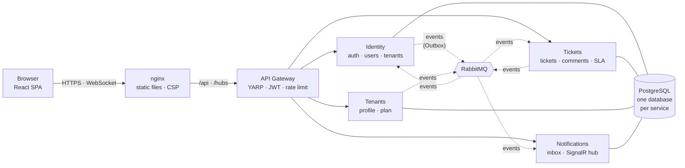

<div align="center">

# HelpDeskFlow

**A multi-tenant help desk SaaS built as .NET 9 microservices, with a React front-end, event-driven communication, real-time updates and a Kubernetes deployment.**

[](https://github.com/Rianzzz/helpdeskflow/actions/workflows/ci.yml)


**English** · [Português](README.pt-BR.md)


</div>

## What it is

Companies sign up, invite their team and customers, and handle support tickets. Each company is an isolated **tenant**:
its data, users and plan limits are invisible to every other company. Customers open tickets, agents answer them,
and everyone is notified **live** when something changes. Internal notes are visible to staff only.

It was built to practice production-grade backend engineering end to end: not just endpoints, but how a system like this is
**split, secured, tested, observed and deployed**.

## Highlights

| | |
|---|---|
| **Microservices** | Identity, Tickets, Tenants and Notifications behind a YARP API gateway; one database per service; services talk through events, never through each other's tables. |
| **Reliable messaging** | RabbitMQ with a **transactional Outbox** (no lost or phantom events), idempotent consumers, retries and a dead-letter queue. |
| **Distributed workflow** | A choreographed **onboarding saga** (Identity → Tenants → Identity) with compensation and a timeout. |
| **Multi-tenancy** | Tenant isolation enforced at the database layer (EF Core global query filters); the tenant always comes from the token, never from the request body. |
| **Security** | JWT with rotating refresh tokens and reuse detection, account lockout, rate limiting, strict CSP, defense in depth. See [docs/seguranca.md](docs/seguranca.md). |
| **Real time** | SignalR pushes notifications to the browser; polling is the automatic fallback. The token in the URL is redacted from every log. |
| **Kubernetes** | Kustomize manifests, Pod Security `restricted`, default-deny NetworkPolicies, init-container migrations, zero-downtime rollouts. Verified by automated tests, including killing pods under load. |
| **Observability** | Structured logs (Serilog), distributed traces that stay connected across the Outbox (OpenTelemetry + Jaeger), health checks. |
| **Quality** | Unit, integration (real PostgreSQL and RabbitMQ via Testcontainers), component and browser tests, accessibility checks (WCAG AA), all in CI. |

<div align="center">
<table>
<tr>
<td></td>
<td></td>
</tr>
<tr>
<td></td>
<td></td>
</tr>
</table>
</div>

## Architecture



Services are layered `Api → Infrastructure → Application → Domain`, and the domain depends on nothing. More in
[docs/arquitetura.md](docs/arquitetura.md) (Portuguese).

## Tech stack

| Area | Technologies |
|---|---|
| Backend | C# · .NET 9 · ASP.NET Core Minimal APIs · EF Core 9 · Npgsql · YARP · SignalR · RabbitMQ.Client |
| Front-end | React 19 · TypeScript · Vite · Tailwind CSS 4 · React Router · TanStack Query |
| Data and messaging | PostgreSQL 17 · RabbitMQ 4 |
| Observability | Serilog · OpenTelemetry · Jaeger · health checks |
| Testing | xUnit · Testcontainers · Vitest · Testing Library · Playwright · axe-core |
| Delivery | Docker (multi-stage, non-root) · Docker Compose · Kubernetes (Kustomize, kind) · GitHub Actions |

## Quick start

You need Docker. The whole platform comes up with two commands:

```bash
cp .env.example .env          # set JWT_SIGNING_KEY (any random string with 32+ bytes)
docker compose --profile apps up -d --build
```

Open **http://localhost:3000**, click *Criar empresa* (create company), and the onboarding saga activates it in a couple of seconds.
The API is at `http://localhost:5000` (gateway); the other services stay on a private Docker network.

<details>
<summary><b>Run on Kubernetes (kind)</b></summary>

```bash
./scripts/k8s-kind.sh up        # creates the cluster, builds and loads the images, generates random secrets, deploys
./scripts/smoke-test.sh http://localhost:8089 http://localhost:8088
./scripts/k8s-verify.sh         # Pod Security, NetworkPolicy and pod-kill resilience checks
./scripts/k8s-kind.sh down
```

Front-end on `http://localhost:8088`, API on `http://localhost:8089`. The decisions behind the manifests are in [k8s/README.md](k8s/README.md).
</details>

<details>
<summary><b>Develop with <code>dotnet run</code> and Vite</b></summary>

```bash
docker compose up -d            # only PostgreSQL and RabbitMQ
dotnet run --project src/Gateway/Gateway.Api --urls http://localhost:5000   # and each service, see docs/executando.md
cd web && npm install && npm run dev                                          # http://localhost:5173
```
</details>

## Tests

| Suite | Count | What it covers |
|---|---|---|
| .NET unit | 92 | domain rules and application services |
| .NET integration | 66 | the real platform on PostgreSQL and RabbitMQ (Testcontainers): saga, tenant isolation, forged JWTs, refresh-token reuse, idempotency, DLQ, SLA job |
| Front-end (Vitest) | 98 | API client, real-time layer, route guards, forms |
| Browser (Playwright) | 56 | full user journeys with several people in isolated browsers, security, accessibility (axe, WCAG AA), mobile |
| Cluster checks | 11 | privileged pod rejected, network paths blocked, 0 failed requests while killing pods |

CI runs everything on every push: build and tests, front-end checks, dependency audits, the complete Docker stack with smoke and browser tests,
and a fresh Kubernetes (kind) cluster. Details in [docs/ci-cd.md](docs/ci-cd.md).

## Design decisions worth reading

- **Why an Outbox?** Saving the data and publishing the event are two systems; one can fail after the other. The event is written in the *same transaction* as the data and published afterwards, so nothing is lost or invented.
- **Why a saga with compensation?** Creating a company touches two services and no distributed transaction exists. Each step is local, and failure triggers an explicit undo.
- **Why events carry no secrets or content?** Passwords never travel in events, and the comment event carries no text: the owning service serves it with the caller's authorization.
- **Why one replica for Notifications?** SignalR keeps connections in memory. Scaling it needs a Redis backplane, documented as the next step instead of hidden.

## Documentation

The deep dives are in Portuguese, in [`docs/`](docs): [architecture](docs/arquitetura.md) · [security](docs/seguranca.md) · [features](docs/funcionalidades.md) · [observability and tests](docs/observabilidade-e-testes.md) · [running](docs/executando.md) · [CI/CD](docs/ci-cd.md) · [Kubernetes](k8s/README.md).

## Roadmap

- [x] Tickets, Identity, API gateway, events, Outbox, SLA job, Tenants and the onboarding saga
- [x] Tests, observability, Docker, CI/CD
- [x] React front-end, Playwright end-to-end tests, real-time notifications (SignalR), ticket conversations, plan limits
- [x] Kubernetes
- [ ] Redis backplane for SignalR (scale Notifications beyond one replica)
- [ ] `httpOnly`-cookie BFF for the refresh token
- [ ] Plan changes and billing events, attachments, ticket pagination and search

## License

[MIT](LICENSE) © Rian Nascimento Alves
