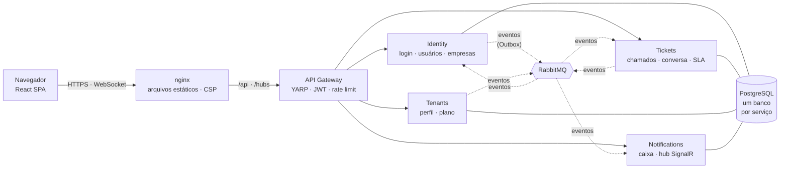

# HelpDeskFlow

[](https://github.com/Rianzzz/helpdeskflow/actions/workflows/ci.yml) 

[English](README.md) · Português

Um help desk para várias empresas, feito com quatro serviços .NET 9 atrás de um gateway e um front-end em React. As empresas se cadastram, adicionam equipe e clientes e atendem chamados de suporte. Cada empresa só enxerga os próprios dados, e todos são avisados ao vivo quando um chamado muda.


*A visão do atendente em um chamado. A mensagem amarela é uma nota interna: o cliente nunca a recebe, nem como notificação.*

Fiz para aprender como um sistema assim é dividido, protegido, testado e implantado. As partes interessantes estão menos nas telas do que no que fica por trás delas.

## O que tem

- **Serviços.** Identity (login, usuários, empresas), Tickets, Tenants (perfil e plano da empresa) e Notifications, atrás de um gateway YARP. Cada serviço tem o próprio banco PostgreSQL e eles só conversam por eventos no RabbitMQ.
- **Eventos que não se perdem.** O serviço grava o evento na mesma transação do dado (Outbox transacional) e um job em segundo plano o publica depois. Quem consome ignora duplicados, tenta de novo se falhar e manda o que continua falhando para uma fila de mensagens mortas.
- **Cadastro de empresa.** Passa pelo Identity e pelo Tenants, e não existe transação entre serviços. Roda como uma saga: se o segundo passo falha, o primeiro é desfeito, e há um tempo limite para quando ninguém responde.
- **Isolamento entre empresas.** Garantido no banco com filtros globais do EF Core. O id da empresa vem sempre do token, nunca do corpo da requisição.
- **Autenticação.** JWT com refresh token rotativo, detecção de reuso, bloqueio de conta e rate limiting. Detalhes em [docs/seguranca.md](docs/seguranca.md).
- **Tempo real.** O SignalR empurra as notificações ao navegador, com consulta periódica como reserva. O token que viaja na URL é redigido em todos os logs.
- **Kubernetes.** Manifestos com Kustomize, Pod Security `restricted`, NetworkPolicy que nega tudo por padrão, migrações em init containers e atualização sem queda. Scripts conferem essas regras, inclusive matando pods enquanto há requisições.
- **Observabilidade.** Logs estruturados, traces distribuídos que continuam ligados através do Outbox e health checks.

## Telas

Todas as telas vêm da plataforma rodando (`cd web && npm run screenshots` as gera de novo).

**Chamados.** Filtros por status, busca e etiquetas de prioridade e status. A equipe vê todos os chamados da empresa; o cliente só vê os próprios.


**Notificações ao vivo.** O contador no menu e esta lista se atualizam sozinhos pelo SignalR. O indicador verde "Ao vivo", no canto inferior esquerdo, mostra que a conexão está de pé; se ela cair, a tela volta a consultar a API.


**Usuários e limite do plano.** O administrador gerencia a equipe. O plano Free permite 5 usuários, e o servidor recusa o excedente mesmo que o botão estivesse escondido.


**No celular.** A mesma lista, com o menu recolhido.


## Arquitetura



Cada serviço tem camadas `Api → Infrastructure → Application → Domain`, e o domínio não depende de nada. Mais em [docs/arquitetura.md](docs/arquitetura.md).

## Tecnologias

| Área | Tecnologias |
|---|---|
| Backend | C#, .NET 9, ASP.NET Core Minimal APIs, EF Core 9, Npgsql, YARP, SignalR, RabbitMQ.Client |
| Front-end | React 19, TypeScript, Vite, Tailwind CSS 4, React Router, TanStack Query |
| Dados e mensageria | PostgreSQL 17, RabbitMQ 4 |
| Observabilidade | Serilog, OpenTelemetry, Jaeger, health checks |
| Testes | xUnit, Testcontainers, Vitest, Testing Library, Playwright, axe-core |
| Entrega | Docker (multi-stage, sem root), Docker Compose, Kubernetes (Kustomize, kind), GitHub Actions |

## Como rodar

Você precisa do Docker.

```bash
cp .env.example .env          # defina JWT_SIGNING_KEY com qualquer texto aleatório de 32+ bytes
docker compose --profile apps up -d --build
```

Abra http://localhost:3000 e use *Criar empresa*. A saga de onboarding a ativa em poucos segundos. A API fica em http://localhost:5000 (o gateway); os demais serviços ficam numa rede Docker privada.

<details>
<summary>Rodar no Kubernetes (kind)</summary>

```bash
./scripts/k8s-kind.sh up        # cria o cluster, constrói e carrega as imagens, gera segredos aleatórios e implanta
./scripts/smoke-test.sh http://localhost:8089 http://localhost:8088
./scripts/k8s-verify.sh         # confere Pod Security, NetworkPolicy e a morte de pods
./scripts/k8s-kind.sh down
```

O front-end fica em http://localhost:8088 e a API em http://localhost:8089. O raciocínio por trás dos manifestos está em [k8s/README.md](k8s/README.md).
</details>

<details>
<summary>Desenvolver com <code>dotnet run</code> e Vite</summary>

```bash
docker compose up -d            # só PostgreSQL e RabbitMQ
dotnet run --project src/Gateway/Gateway.Api --urls http://localhost:5000   # e cada serviço, veja docs/executando.md
cd web && npm install && npm run dev                                          # http://localhost:5173
```
</details>

## Testes

| Conjunto | Quantidade | O que cobre |
|---|---|---|
| .NET unitários | 92 | regras de domínio e serviços de aplicação |
| .NET integração | 66 | a plataforma em PostgreSQL e RabbitMQ reais (Testcontainers): a saga, isolamento entre empresas, JWT forjado, reuso de refresh token, idempotência, fila de mensagens mortas, job de SLA |
| Front-end (Vitest) | 98 | cliente de API, tempo real, guardas de rota, formulários |
| Navegador (Playwright) | 56 | jornadas completas com várias pessoas em navegadores isolados, segurança, acessibilidade (axe, WCAG AA), celular |
| Verificações do cluster | 11 | pod privilegiado recusado, caminhos de rede bloqueados, nenhuma requisição falha enquanto pods são mortos |

O CI roda tudo a cada push: build e testes, checagens do front-end, auditoria de dependências, a pilha Docker completa com testes de fumaça e de navegador, e um cluster Kubernetes (kind) novo. Veja [docs/ci-cd.md](docs/ci-cd.md).

## Decisões

- **Outbox.** Salvar o dado e publicar o evento são dois sistemas diferentes, e um pode falhar depois do outro. Gravar o evento na mesma transação do dado e publicá-lo depois garante que nenhum evento se perca e nenhum seja inventado.
- **Saga.** Criar uma empresa passa por dois serviços e não existe transação distribuída. Cada passo é local e uma falha dispara um desfazer explícito.
- **Eventos sem segredos.** A senha nunca viaja em eventos, e o evento de comentário não leva o texto. Quem entrega o comentário é o serviço dono dele, conferindo quem está pedindo.
- **Uma réplica do Notifications.** O SignalR guarda as conexões na memória, então mais réplicas exigem um backplane Redis. Está no roadmap.

## Documentação

Os textos mais longos ficam em [`docs/`](docs): [arquitetura](docs/arquitetura.md), [segurança](docs/seguranca.md), [funcionalidades](docs/funcionalidades.md), [observabilidade e testes](docs/observabilidade-e-testes.md), [como rodar](docs/executando.md), [CI/CD](docs/ci-cd.md) e [Kubernetes](k8s/README.md).

## Roadmap

- [x] Tickets, Identity, gateway, eventos, Outbox, job de SLA, Tenants e a saga de onboarding
- [x] Testes, observabilidade, Docker, CI/CD
- [x] Front-end React, testes com Playwright, notificações em tempo real, conversa nos chamados, limites do plano
- [x] Kubernetes
- [ ] Backplane Redis para o SignalR, para rodar mais de uma réplica do Notifications
- [ ] Cookie `httpOnly` para o refresh token, por meio de um BFF
- [ ] Mudança de plano e cobrança, anexos, paginação e busca de chamados

## Licença

[MIT](LICENSE) © Rian Nascimento Alves
