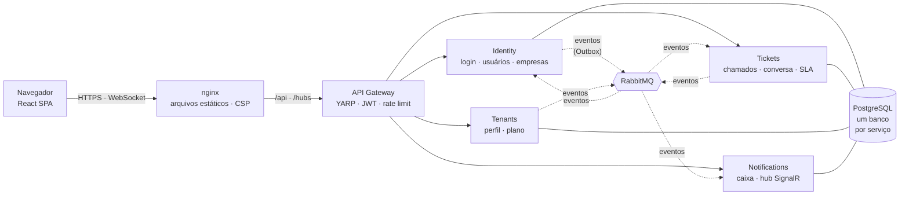

<div align="center">

# HelpDeskFlow

**SaaS multi-tenant de help desk construído em microsserviços .NET 9, com front-end em React, comunicação por eventos, atualizações em tempo real e deploy em Kubernetes.**

[](https://github.com/Rianzzz/helpdeskflow/actions/workflows/ci.yml)


[English](README.md) · **Português**


</div>

## O que é

Empresas se cadastram, convidam a equipe e os clientes, e atendem chamados de suporte. Cada empresa é um **tenant** isolado:
dados, usuários e limites do plano são invisíveis para qualquer outra empresa. Clientes abrem chamados, atendentes respondem,
e todos são avisados **ao vivo** quando algo muda. Notas internas só a equipe vê.

O projeto foi construído para praticar engenharia de backend de nível profissional de ponta a ponta: não só endpoints, mas como um
sistema assim é **dividido, protegido, testado, observado e implantado**.

## Destaques

| | |
|---|---|
| **Microsserviços** | Identity, Tickets, Tenants e Notifications atrás de um gateway YARP; um banco por serviço; os serviços conversam por eventos, nunca pelas tabelas uns dos outros. |
| **Mensageria confiável** | RabbitMQ com **Outbox transacional** (sem eventos perdidos nem fantasmas), consumidores idempotentes, novas tentativas e fila de mensagens mortas (DLQ). |
| **Fluxo distribuído** | **Saga de onboarding** coreografada (Identity → Tenants → Identity) com compensação e timeout. |
| **Multi-tenancy** | Isolamento garantido na camada de banco (filtros globais do EF Core); o tenant sempre vem do token, nunca do corpo da requisição. |
| **Segurança** | JWT com refresh token rotativo e detecção de reuso, bloqueio de conta, rate limiting, CSP restritiva, defesa em profundidade. Veja [docs/seguranca.md](docs/seguranca.md). |
| **Tempo real** | SignalR empurra as notificações ao navegador; a consulta periódica é o fallback automático. O token na URL é redigido em todos os logs. |
| **Kubernetes** | Manifestos com Kustomize, Pod Security `restricted`, NetworkPolicy "nega tudo", migrações em initContainer, atualização sem queda. Verificado por testes automatizados, inclusive matando pods sob carga. |
| **Observabilidade** | Logs estruturados (Serilog), traces distribuídos que continuam ligados através do Outbox (OpenTelemetry + Jaeger), health checks. |
| **Qualidade** | Testes unitários, de integração (PostgreSQL e RabbitMQ reais via Testcontainers), de componentes e de navegador, com acessibilidade (WCAG AA), tudo no CI. |

<div align="center">
<table>
<tr>
<td></td>
<td></td>
</tr>
<tr>
<td></td>
<td></td>
</tr>
</table>
</div>

## Arquitetura



Cada serviço tem camadas `Api → Infrastructure → Application → Domain`, e o domínio não depende de nada. Mais em
[docs/arquitetura.md](docs/arquitetura.md).

## Tecnologias

| Área | Tecnologias |
|---|---|
| Backend | C# · .NET 9 · ASP.NET Core Minimal APIs · EF Core 9 · Npgsql · YARP · SignalR · RabbitMQ.Client |
| Front-end | React 19 · TypeScript · Vite · Tailwind CSS 4 · React Router · TanStack Query |
| Dados e mensageria | PostgreSQL 17 · RabbitMQ 4 |
| Observabilidade | Serilog · OpenTelemetry · Jaeger · health checks |
| Testes | xUnit · Testcontainers · Vitest · Testing Library · Playwright · axe-core |
| Entrega | Docker (multi-stage, sem root) · Docker Compose · Kubernetes (Kustomize, kind) · GitHub Actions |

## Como rodar

Você precisa do Docker. A plataforma inteira sobe com dois comandos:

```bash
cp .env.example .env          # defina JWT_SIGNING_KEY (qualquer texto aleatório com 32+ bytes)
docker compose --profile apps up -d --build
```

Abra **http://localhost:3000**, clique em *Criar empresa* e a saga de onboarding a ativa em poucos segundos.
A API fica em `http://localhost:5000` (gateway); os demais serviços ficam numa rede Docker privada.

<details>
<summary><b>Rodar no Kubernetes (kind)</b></summary>

```bash
./scripts/k8s-kind.sh up        # cria o cluster, constrói e carrega as imagens, gera segredos aleatórios e implanta
./scripts/smoke-test.sh http://localhost:8089 http://localhost:8088
./scripts/k8s-verify.sh         # Pod Security, NetworkPolicy e resiliência ao matar pods
./scripts/k8s-kind.sh down
```

Front-end em `http://localhost:8088`, API em `http://localhost:8089`. As decisões por trás dos manifestos estão em [k8s/README.md](k8s/README.md).
</details>

<details>
<summary><b>Desenvolver com <code>dotnet run</code> e Vite</b></summary>

```bash
docker compose up -d            # só PostgreSQL e RabbitMQ
dotnet run --project src/Gateway/Gateway.Api --urls http://localhost:5000   # e cada serviço, veja docs/executando.md
cd web && npm install && npm run dev                                          # http://localhost:5173
```
</details>

## Testes

| Conjunto | Quantidade | O que cobre |
|---|---|---|
| .NET unitários | 92 | regras de domínio e serviços de aplicação |
| .NET integração | 66 | a plataforma de verdade com PostgreSQL e RabbitMQ (Testcontainers): saga, isolamento entre empresas, JWT forjado, reuso de refresh token, idempotência, DLQ, job de SLA |
| Front-end (Vitest) | 98 | cliente de API, tempo real, guardas de rota, formulários |
| Navegador (Playwright) | 56 | jornadas completas com várias pessoas em navegadores isolados, segurança, acessibilidade (axe, WCAG AA), celular |
| Verificações do cluster | 11 | pod privilegiado recusado, caminhos de rede bloqueados, 0 requisições com falha ao matar pods |

O CI roda tudo a cada push: build e testes, checagens do front-end, auditoria de dependências, a pilha Docker completa com testes de fumaça e de
navegador, e um cluster Kubernetes (kind) novo. Detalhes em [docs/ci-cd.md](docs/ci-cd.md).

## Decisões de projeto que vale ler

- **Por que um Outbox?** Salvar o dado e publicar o evento são dois sistemas; um pode falhar depois do outro. O evento é gravado na *mesma transação* do dado e publicado depois, então nada se perde nem é inventado.
- **Por que uma saga com compensação?** Criar uma empresa envolve dois serviços e não existe transação distribuída. Cada passo é local, e a falha dispara um desfazer explícito.
- **Por que eventos sem segredos nem conteúdo?** A senha nunca viaja em eventos, e o evento de comentário não leva o texto: o serviço dono o entrega com a autorização de quem pede.
- **Por que uma réplica no Notifications?** O SignalR guarda as conexões na memória. Escalar exige um backplane Redis, documentado como próximo passo em vez de escondido.

## Documentação

Os detalhes ficam em [`docs/`](docs): [arquitetura](docs/arquitetura.md) · [segurança](docs/seguranca.md) · [funcionalidades](docs/funcionalidades.md) · [observabilidade e testes](docs/observabilidade-e-testes.md) · [executando](docs/executando.md) · [CI/CD](docs/ci-cd.md) · [Kubernetes](k8s/README.md).

## Roadmap

- [x] Tickets, Identity, API gateway, eventos, Outbox, job de SLA, Tenants e a saga de onboarding
- [x] Testes, observabilidade, Docker, CI/CD
- [x] Front-end React, testes de ponta a ponta com Playwright, notificações em tempo real (SignalR), conversa nos chamados, limites do plano
- [x] Kubernetes
- [ ] Backplane Redis para o SignalR (escalar o Notifications além de uma réplica)
- [ ] BFF com cookie `httpOnly` para o refresh token
- [ ] Eventos de mudança de plano e cobrança, anexos, paginação de chamados

## Licença

[MIT](LICENSE) © Rian Nascimento Alves
